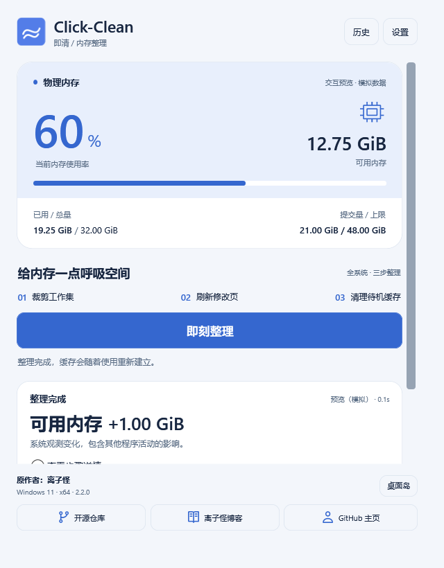
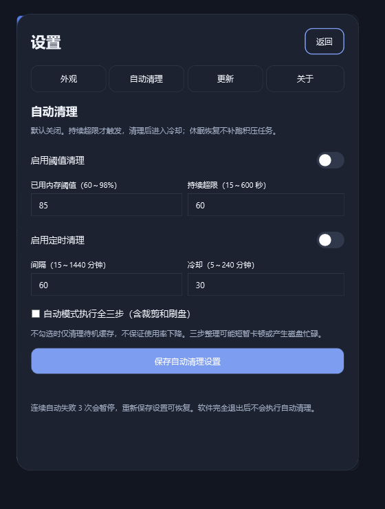

# Click-Clean 即清

Windows 11 x64 的中文内存整理工具，使用 C#、.NET 10 和原生 WPF。

主窗口动态胶囊显示待机、当前步骤、结果与更新状态；可选桌面迷你岛提供轻量入口。支持手动整理，以及默认关闭的阈值清理和定时清理。





截图使用明确标注的模拟数据，不是本机清理效果承诺。

## 下载与启动

从本仓库 [Releases](https://github.com/ice11123/Click-Clean/releases) 下载正式包，核对同版本 SHA-256。安装包默认申请管理员权限，桌面快捷方式默认不勾选。便携包解压后保留完整目录，运行 `current/ClickClean.exe`。

程序默认管理员启动，UAC 开启时可能要求确认。关闭主窗口默认进入托盘；最小化保留任务栏。托盘可以打开、整理、显示桌面岛或退出。登录启动默认关闭，开启后为当前账户创建最高权限计划任务，登录后进入托盘。

脚本或快捷方式也可使用 `current/ClickClean.exe --exit` 请求正常退出；会等待当前整理步骤返回，不强行结束系统调用。此命令同样受管理员清单与 UAC 保护。

## 整理与自动化

手动一键整理按顺序执行：裁剪全系统工作集、刷新修改页、清理待机缓存。自定义组合顺序不变。每步检查系统返回码，失败后停止后续操作；取消不打断当前系统调用。

结果包含可用内存变化、耗时和步骤详情；变化可为零或负值，读取失败显示未知。整理可能短暂造成缺页或磁盘忙碌，缓存会重新建立。可用内存增加不等于提速，也不能修复其他程序的内存泄漏。

“设置 → 自动清理”提供两个独立开关，保存后生效：

| 参数 | 默认 |
| --- | --- |
| 阈值清理 | 关闭；85% 持续 60 秒 |
| 定时清理 | 关闭；每 60 分钟 |
| 冷却 | 30 分钟 |
| 自动步骤 | 待机缓存；可主动选全三步 |

阈值需下降 5 个百分点才重新武装。手动整理也进入冷却，触发相撞合并，忙碌时不积压任务，休眠恢复不补跑。连续自动失败 3 次暂停，重新保存设置可恢复。只清理待机缓存不保证降低使用率。软件完全退出后不会自动清理。

## 更新与数据

“设置 → 更新”可手动检查；自动检查在启动后一次，此后约每 6 小时。检查和后台下载可独立关闭。普通更新通过 Velopack 下载、校验，在“重启并更新”后退出替换程序，无需安装向导。整理中不应用更新，可选收起到托盘时自动应用，默认关闭。

首次从清栖迁移，或安装机制改变时，可能仍需安装包。未发布新版本时报告当前版本；网络或仓库不可用时保留现有程序并显示错误。

如果已经下载的更新缓存被磁盘错误等损坏，程序会拒绝应用并保留旧版。请先正常退出，只删除程序根目录 `packages` 内对应版本的 `ClickClean-版本-full.nupkg`，再启动并检查下载；不要删除 `current`、`Update.exe` 或用户数据目录。首版不自动删除损坏缓存。

设置、最近 30 次记录和轮转日志在 `%LOCALAPPDATA%/ClickCleanData`，与程序目录分开。首次运行复制旧清栖的有效设置与历史，保留旧数据；新增自动功能默认关闭。卸载默认保留用户数据，可以选择删除。分享导出的诊断前请检查个人信息。

当前包未进行 Authenticode 签名，也无安全厂商认证。正常使用不需要关闭杀毒、绕过 UAC 或运行下载执行脚本。

安装或卸载前请从托盘正常退出；安装程序不会强行结束整理中的进程。若使用其他管理员账户输入凭据提权，当前用户目录和设置归属可能改变，建议在安装账户本身具备管理员权限时使用。

## 从源码构建

需要 Windows 11 x64、.NET SDK 10.0.301 或允许的补丁版本，以及完整安装包所需的官方 Inno Setup 7。

```powershell
.\build-assets.ps1
dotnet run --project Tests/ClickClean.Tests.csproj -c Release
.\build.ps1 -OutputRoot .\dist -IncludePreview
```

没有 Inno Setup 可加 `-SkipInstaller`，生成可更新便携包和源码包。CLI 通过 `.config/dotnet-tools.json` 固定版本还原；图标源图片内置于 `App/Assets/ClickClean.png`，`build-assets.ps1` 离线导出多尺寸 ICO，无需下载图片。

```powershell
dotnet run --project Diagnostics/ClickClean.Preview.csproj -c Release
```

交互预览用模拟内存和整理，不提权、不创建登录任务、不下载更新。真实实测入口仅在独立 Diagnostics 程序的 `--system-check 输出文件`，必须明确选择并确认管理员权限。正式程序无此实测入口。

Diagnostics 还提供 `--verify-updates 发布目录 输出目录`，验证从旧版本到发布目录中最新正式版本的本地发现、下载、待重启、同版本、降级和损坏包处理；不会替换已安装软件。专用测试目录中的真实替换另用 `--apply-update-fixture 测试目录 发布目录 输出文件`，必须有测试标记并显式确认管理员权限。不得对日常安装目录运行该诊断。

源码包包含构建、图标生成、锁文件与文档，不含用户数据、凭据或构建缓存。CI 构建与发布流程见 `.github/workflows`。

已执行检查和未覆盖项目见 [验收记录](docs/verification.md)。桌面岛首版约束在主屏工作区，暂不支持跨显示器持久定位。

## 开源

Copyright © 2026 ice11123 及 Click-Clean 贡献者。源码为 [GPL-3.0-only](LICENSE)，按许可证允许使用、复制、修改和分发，不提供担保。见 [品牌说明](BRANDING.md)、[第三方声明](THIRD-PARTY-NOTICES.md)、[贡献指南](CONTRIBUTING.md)、[安全说明](SECURITY.md) 和 [架构](docs/architecture.md)。项目独立实现 Windows API，不复制 PCL 或 Apple 资源。
